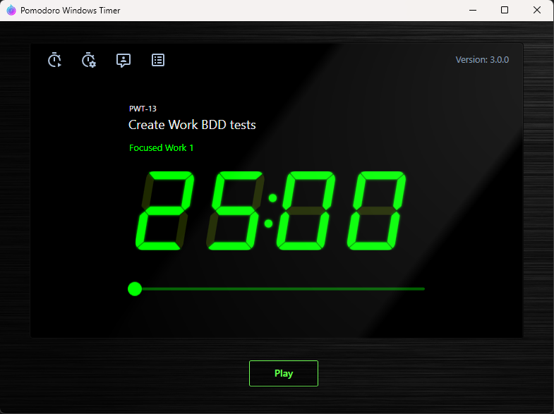

PomodoroWindowsTimer
====================

<br/>



<br/>

Yet another Pomodoro timer for Windows, but!

It uses minimizing windows functionality and Telegram Chat Bor for notifications:

- When `Focused Work` time is count down all window are minimized, timer window is stay on
- When `Break` time is count down all minimized windows are restored and you'll receive a message in telegram bot

<br/>

## Installation

1. Create a Telegram bot
2. Run PomodoroWindowsTimer.ChatIdGrabber to determine chat ID
3. Add appsettings.json with next keys

```json
{
  "BotConfiguration": {
    "BotToken": "<your_token>",
    "MyChatId": "<your_chat_id>"
  }
}
```

4. Or run PomodoroWindowsTimer.WpfClient and input credentials in it (side menu (drawer) -> `"BOT SETTINGS"` button)

<br/>


<br/>
