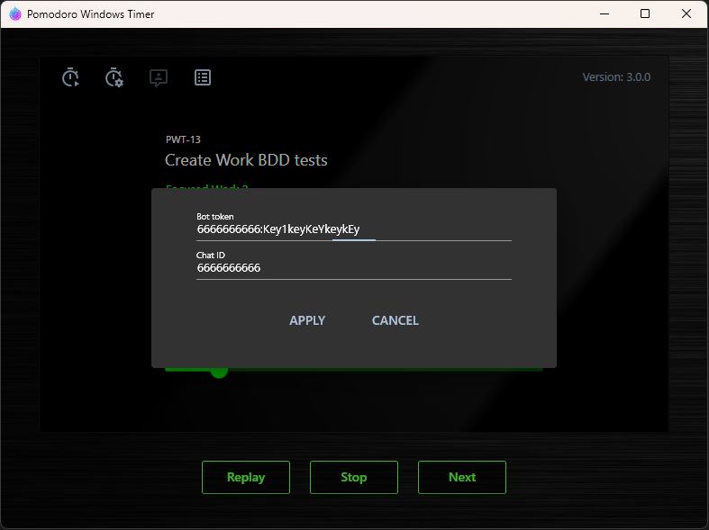

PomodoroWindowsTimer
====================

*Version: 3.0.0*

<br/>

Yet another Pomodoro timer for Windows with the following features:

- Minimizes all windows when wokt time is gone. It really makes you distracted to make a decision to work further, getting covered in a ruddy crust or give your eyes a rest.

- Telegram notifications. More often than not, rest is not at the computer and you need a bell for class.

<br/>

## Installation

1. Create a Telegram bot
2. Run PomodoroWindowsTimer.ChatIdGrabber to determine chat ID or use your own solution.
3. Use appsettings.json keys:

```json
{
  "BotConfiguration": {
    "BotToken": "<your_token>",
    "MyChatId": "<your_chat_id>"
  },
  "WorkDb": { 
    "ConnectionString": "Data Source=<path-to-sqlite-db-file>;"
  },
}
```

<br/>

4. Before use new version run PomodoroWindowsTimer.Migrator to apply db migrations:

```ps
.\PomodoroWindowsTimer.Migrator.exe --connection "Data Source=..\..\..\..\PomodoroWindowsTimer.WpfClient\bin\Debug\net8.0-windows\work.db;"
```

## Interface

<br/>

### Main Window

<br/>


<br/>

### Time Point List left drawer

<br/>


<br/>

### Work List right drawer

<br/>


<br/>

### Telegram Bot settings dialog

<br/>



<br/>

### Work Statistic window

At par values are calcilated according pomodoro sequence.

<br/>


<br/>

#### Work Statistic window Add Work Time dialog

<br/>


<br/>

#### Work Statistic window Work Events dialog

<br/>


<br/>