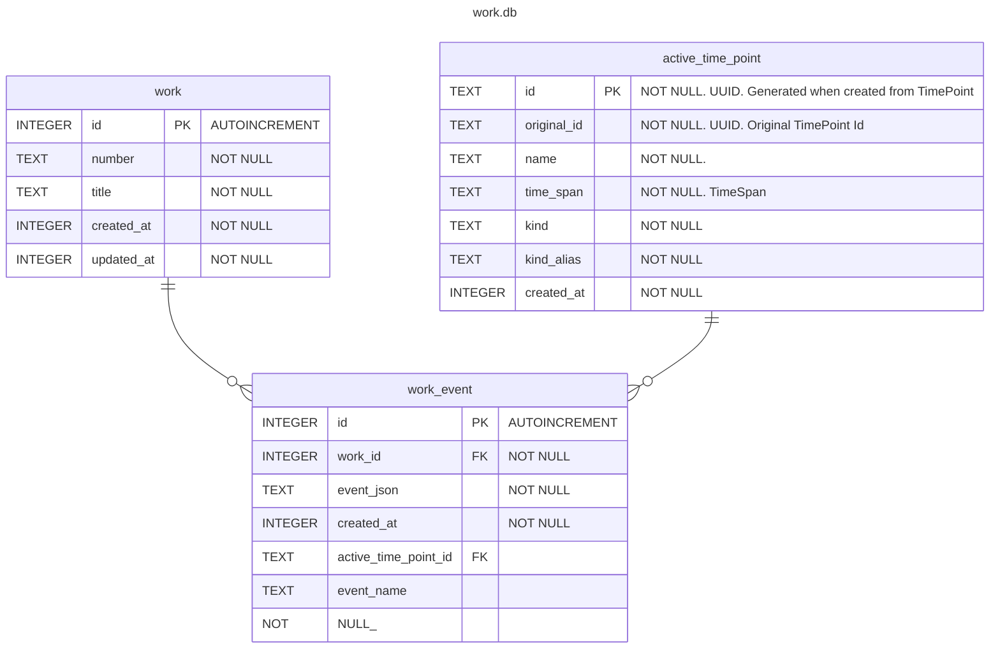

## ER Diagram

```mermaid
---
title: work.db
---
erDiagram
    work {
        INTEGER id PK "AUTOINCREMENT"
        TEXT number "NOT NULL"
        TEXT title "NOT NULL"
        INTEGER created_at "NOT NULL"
        INTEGER updated_at "NOT NULL"
    }

    work_event {
        INTEGER id PK "AUTOINCREMENT"
        INTEGER work_id FK "NOT NULL"
        TEXT event_json "NOT NULL"
        INTEGER created_at "NOT NULL"
        TEXT active_time_point_id FK
        TEXT event_name NOT NULL_
    }

    work ||--o{ work_event : ""

    active_time_point {
        TEXT id PK "NOT NULL. UUID. Generated when created from TimePoint"
        TEXT original_id "NOT NULL. UUID. Original TimePoint Id"
        TEXT name "NOT NULL."
        TEXT time_span "NOT NULL. TimeSpan"
        TEXT kind "NOT NULL"
        TEXT kind_alias "NOT NULL"
        INTEGER created_at "NOT NULL"
    }

    active_time_point ||--o{ work_event : ""
```